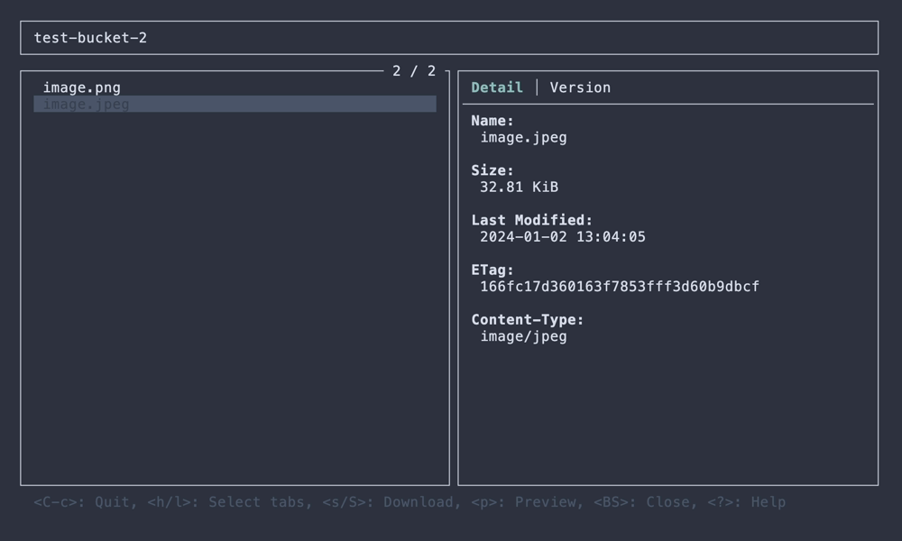
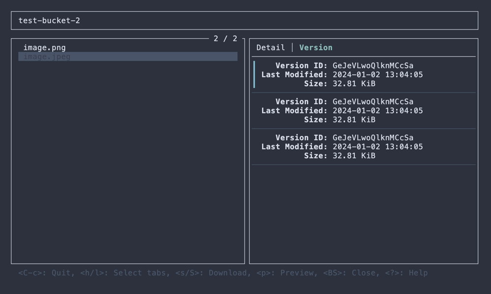
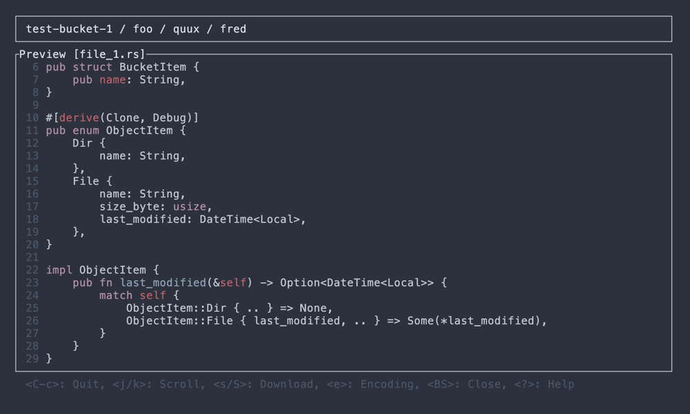

# STU

[](https://crates.io/crates/stu)

S3 Terminal UI

## About

STU is the TUI application for AWS S3 written in Rust using [ratatui](https://github.com/ratatui-org/ratatui).


## Installation

### Cargo

```
$ cargo install stu
```

### Homebrew (macOS)

```
$ brew install lusingander/tap/stu
```

### AUR (Arch Linux)

```
$ paru -S stu
```

### Binary

You can download binaries from [releases](https://github.com/lusingander/stu/releases)

## Usage

```
STU - S3 Terminal UI

Usage: stu [OPTIONS]

Options:
  -r, --region <REGION>     AWS region
  -e, --endpoint-url <URL>  AWS endpoint url
  -p, --profile <NAME>      AWS profile name
  -b, --bucket <NAME>       Target bucket name
  -h, --help                Print help
  -V, --version             Print version
```

You can also use each environment variable in the same way as [when using the AWS CLI](https://docs.aws.amazon.com/cli/latest/userguide/cli-configure-envvars.html).

Detailed operations on each view can be displayed by pressing `?` key.

Or refer to the `***-help.png` screenshots in the [./img directory](./img).

### Config

Config is loaded from `$STU_ROOT_DIR/config.toml`.

- If `STU_ROOT_DIR` environment variable is not set, `~/.stu` is used by default.
- If the file does not exist, it will be created automatically at startup.

The values that can be set are as follows:

- `download_dir`: _string_ - Directory to save when downloading objects (_default_: `$STU_ROOT_DIR/download`)

## Features / Screenshots

### Bucket list

- Show list of buckets


### Object list

- Show list of objects in a hierarchy


### Object detail

- Show object details
- Download object
- Preview object (text file only)
- Copy resource name to clipboard







## License

MIT
