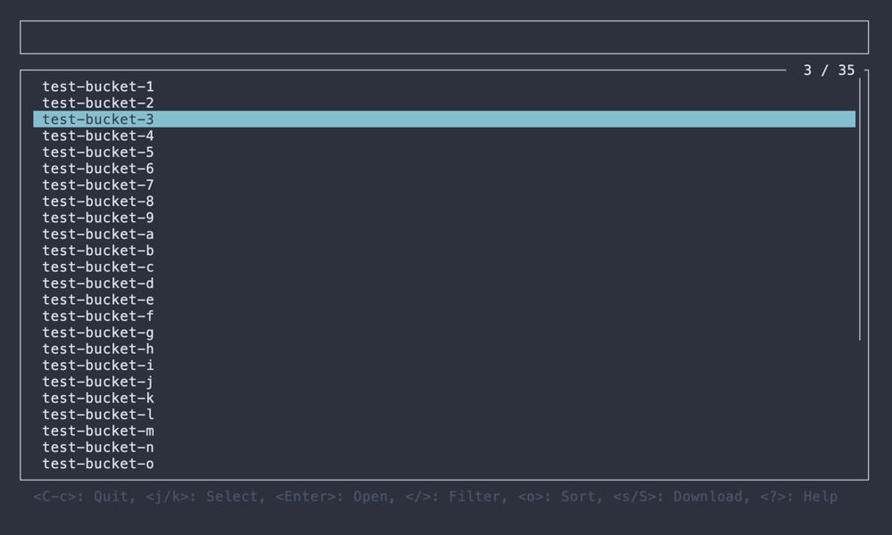

# STU

[](https://crates.io/crates/stu)

S3 Terminal UI

## About

STU is the TUI application for AWS S3 written in Rust using [ratatui](https://github.com/ratatui-org/ratatui).


## Installation

### Cargo

```
$ cargo install stu
```

### Homebrew

```
$ brew install lusingander/tap/stu
```

## Usage

```
STU - S3 Terminal UI

Usage: stu [OPTIONS]

Options:
  -r, --region <REGION>     AWS region
  -e, --endpoint-url <URL>  AWS endpoint url
  -p, --profile <NAME>      AWS profile name
  -h, --help                Print help
  -V, --version             Print version
```

Detailed operations on each view can be displayed by pressing `?` key.

Or refer to the `***-help.png` screenshots in the [./img directory](./img).

### Config

Config is loaded from `~/.stu/config.toml`. If the file does not exist, it will be created automatically at startup.

The values that can be set are as follows:

- `download_dir`: _string_ - Directory to save when downloading objects (_default_: `~/.stu/download`)

## Screenshots

### Bucket list



### Object list


### Object detail


## License

MIT
