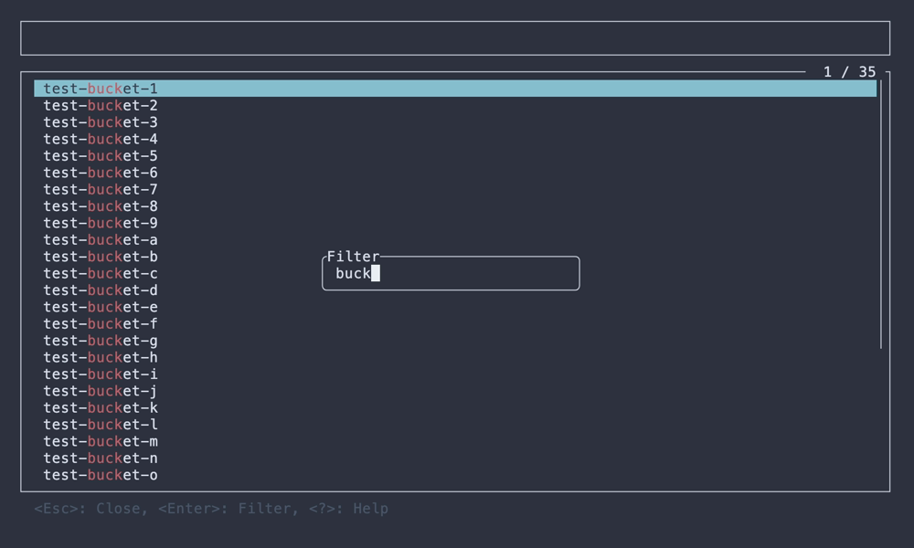
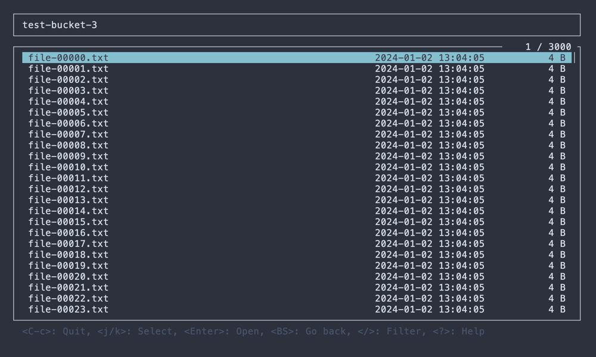
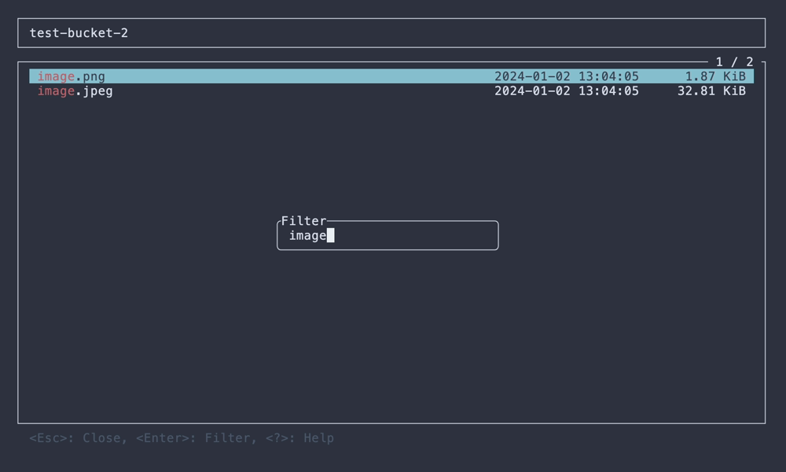
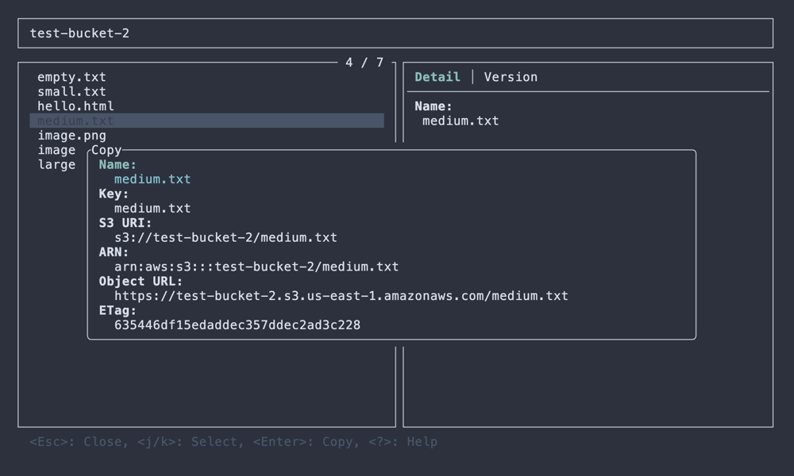

# STU

[](https://crates.io/crates/stu)
[](https://ratatui.rs)

S3 Terminal UI 🪣


## About

STU, S3 Terminal UI, is a interactive terminal-based explorer for Amazon S3 (AWS S3).

With STU, you can browse buckets and objects directly from your terminal, preview files, and download them with ease.

STU provides the following features:

- Recursive object downloads
- Previews with syntax highlighting for text files and inline rendering for images
- Access to previous object versions
- Customizable key bindings
- Support for S3-compatible storage

Check out the [Features](https://lusingander.github.io/stu/features.html) section for more details!

## Documentation

For detailed usage, configuration, and advanced features, see the [full documentation](https://lusingander.github.io/stu/).

## Installation

If you're using Cargo:

```
$ cargo install --locked stu
```

For other download options, see [Installation](https://lusingander.github.io/stu/installation.html).

## Usage

After installation, run the following command:

```
$ stu
```

Basically, you can use it in [the same way as the AWS CLI](https://docs.aws.amazon.com/cli/latest/userguide/cli-configure-files.html).

In other words, if the default profile settings exist or [the environment variables are set](https://docs.aws.amazon.com/cli/latest/userguide/cli-configure-envvars.html), you do not need to specify any options.

### Options

```
STU - S3 Terminal UI

Usage: stu [OPTIONS]

Options:
  -r, --region <REGION>     AWS region
  -e, --endpoint-url <URL>  AWS endpoint url
  -p, --profile <NAME>      AWS profile name
  -b, --bucket <NAME>       Target bucket name
  -P, --prefix <PREFIX>     Prefix for object keys
      --path-style <TYPE>   Path style type for object paths [default: auto] [possible values: auto, always, never]
      --debug               Enable debug logs
  -h, --help                Print help
  -V, --version             Print version
```

For details on each option, see [Command Line Options](https://lusingander.github.io/stu/command-line-options.html).

### Keybindings

The basic key bindings are as follows:

| Key                  | Description                  |
| -------------------- | ---------------------------- |
| <kbd>Ctrl-C</kbd>    | Quit app                     |
| <kbd>Enter</kbd>     | Confirm / Open selected item |
| <kbd>Backspace</kbd> | Go back to previous          |
| <kbd>j/k</kbd>       | Select item / Scroll         |
| <kbd>?</kbd>         | Show help                    |

Detailed operations on each view can be displayed by pressing `?` key.

You can customize your own keybindings.
See [Custom Keybindings](https://lusingander.github.io/stu/custom-keybindings.html) for more information.

### Config

Config is loaded from `$STU_ROOT_DIR/config.toml`.

- If `STU_ROOT_DIR` environment variable is not set, `~/.stu` is used by default.
  - If the `STU_ROOT_DIR` directory does not exist, it will be created automatically.
- If the config file does not exist, the default values will be used for all items.
- If the config file exists but some items are not set, the default values will be used for those unset items.

For detailed information about the config file format, see [Config File Format](https://lusingander.github.io/stu/config-file-format.html).

## Screenshots

### Bucket list

    

### Object list

       

### Object detail

   

### Object preview

  

## Contributing

To get started with contributing, please review [CONTRIBUTING.md](CONTRIBUTING.md).

Contributions that do not follow these guidelines may not be accepted.

## Related projects

- [DDV](https://github.com/lusingander/ddv) - Terminal DynamoDB Viewer ⚡️

## License

MIT
