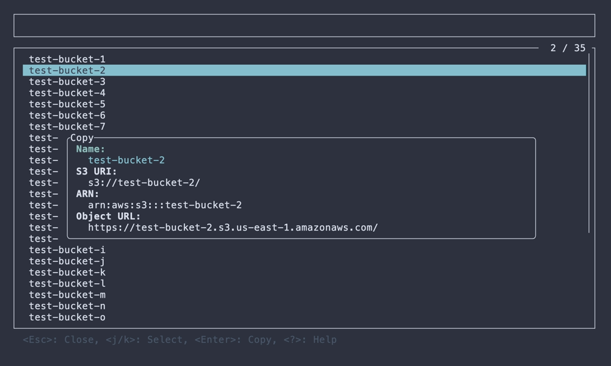
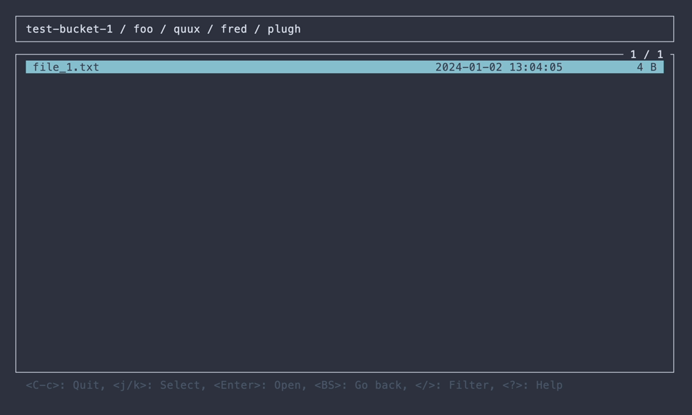
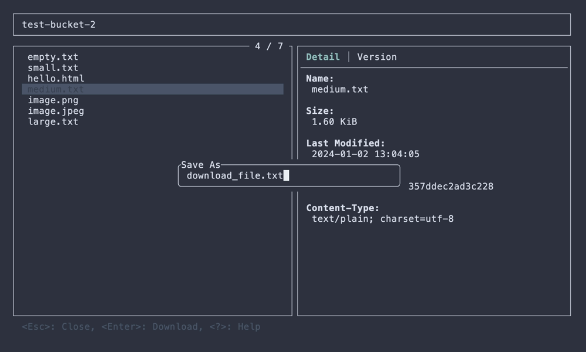

# STU

[](https://crates.io/crates/stu)

S3 Terminal UI 🪣


## About

STU is the TUI explorer application for Amazon S3 (AWS S3) written in Rust using [ratatui](https://github.com/ratatui/ratatui).

STU provides the following features:

- Recursive download of objects
- Preview with syntax highlighting for text and image rendering
- Access to past versions of objects
- Customizable key bindings
- Support for S3-compatible storage

Check out the [Features / Screenshots](#features--screenshots) section for more details!

## Installation

### [Cargo](https://crates.io/crates/stu)

```
$ cargo install --locked stu
```

### [Homebrew (macOS)](https://github.com/lusingander/homebrew-tap/blob/master/stu.rb)

```
$ brew install lusingander/tap/stu
```

### [AUR (Arch Linux)](https://aur.archlinux.org/packages/stu)

```
$ paru -S stu
```

### Binary

You can download binaries from [releases](https://github.com/lusingander/stu/releases).

## Usage

After installation, run the following command:

```
$ stu
```

Basically, you can use it in [the same way as the AWS CLI](https://docs.aws.amazon.com/cli/latest/userguide/cli-configure-files.html).

In other words, if the default profile settings exist or [the environment variables are set](https://docs.aws.amazon.com/cli/latest/userguide/cli-configure-envvars.html), you do not need to specify any options.

### Options

```
STU - S3 Terminal UI

Usage: stu [OPTIONS]

Options:
  -r, --region <REGION>     AWS region
  -e, --endpoint-url <URL>  AWS endpoint url
  -p, --profile <NAME>      AWS profile name
  -b, --bucket <NAME>       Target bucket name
      --path-style <TYPE>   Path style type for object paths [default: auto] [possible values: auto, always, never]
      --debug               Enable debug logs
  -h, --help                Print help
  -V, --version             Print version
```

Here are some examples of how to run with options:

```sh
# Connect by specifying the profile
$ stu --profile foo-profile

# Show only the specified bucket objects
$ stu --bucket bar-bucket

# Connect to localstack, minio, etc.
$ stu --endpoint-url http://localhost:12345

# Connect by specifying environment variables
$ AWS_ACCESS_KEY_ID=abc AWS_SECRET_ACCESS_KEY=xyz stu
```

#### --path-style \<TYPE\>

Select the address model for S3 objects.

- `never` uses Virtual-Hosted Style, which is what AWS currently uses.
  - `https://bucket.s3.region.amazonaws.com/key`
- `always` uses Path Style, which is used when using localstack, minio, etc.
  - `https://s3.region.amazonaws.com/bucket/key`
- `auto` automatically determines which model to use, which is the default setting.

For other S3-compatible services, which one to use depends on the service.

### Keybindings

#### Default

The basic key bindings are as follows:

| Key                  | Description                  |
| -------------------- | ---------------------------- |
| <kbd>Ctrl-C</kbd>    | Quit app                     |
| <kbd>Enter</kbd>     | Confirm / Open selected item |
| <kbd>Backspace</kbd> | Go back to previous          |
| <kbd>j/k</kbd>       | Select item / Scroll         |
| <kbd>?</kbd>         | Show help                    |

Detailed operations on each view can be displayed by pressing `?` key.

#### Custom keybindings

You can set your own custom key bindings.

Custom bindings are loaded from `$STU_ROOT_DIR/keybindings.toml`.

The default key bindings are defined in [./assets/keybindings.toml](./assets/keybindings.toml). You can set key bindings for each screen action in the same format.

- It is possible to set multiple key bindings for one action.
- If you do not set key bindings for an action, the default key bindings will be assigned.
- You can disable an action by setting `[]` as the key bindings.

### Config

Config is loaded from `$STU_ROOT_DIR/config.toml`.

- If `STU_ROOT_DIR` environment variable is not set, `~/.stu` is used by default.
  - If the `STU_ROOT_DIR` directory does not exist, it will be created automatically.
- If the config file does not exist, the default values will be used for all items.
- If the config file exists but some items are not set, the default values will be used for those unset items.

#### Config file format

The values set in this example are the default values.

```toml
# The directory to save the downloaded objects.
# type: string
download_dir = "$STU_ROOT_DIR/download"
# The maximum number of concurrent requests when recursive downloading objects.
# type: usize
max_concurrent_requests = 5
# The default region to use if the region cannot be obtained from the command line options or AWS settings.
# type: string
default_region = "us-east-1"

[ui.object_list]
# The date format of a last modified in the object list.
# The format must be specified in strftime format.
# https://docs.rs/chrono/latest/chrono/format/strftime/index.html
# type: string
date_format = "%Y-%m-%d %H:%M:%S"
# The width of a last modified in the object list.
# It is recommended to set this when setting date_format.
# type: u16
date_width = 19

[ui.object_detail]
# The date format of a last modified in the object detail.
# The format must be specified in strftime format.
# https://docs.rs/chrono/latest/chrono/format/strftime/index.html
# type: string
date_format = "%Y-%m-%d %H:%M:%S"

[ui.help]
# The maximum width of the keybindings display area in the help.
# type: usize
max_help_width = 100

[preview]
# Whether syntax highlighting is enabled in the object preview.
# type: bool
highlight = false
# The name of the color theme to use for syntax highlighting in the object preview.
# type: string
highlight_theme = "base16-ocean.dark"
# Whether image file preview is enabled in the object preview.
# type: bool
image = false
# Array of labels for the encoding want to use.
# Label names should be specified from https://encoding.spec.whatwg.org/#names-and-labels.
# type: array of strings
encodings = [
  "utf-8",
  "utf-16be",
  "utf-16le",
]
```

### Syntax highlighting

In the object preview, Syntax highlighting using syntect is available. To enable this, set `preview.highlight = true` in the config file.

#### Color themes

You can change the color theme by specifying the theme name in `preview.highlight_theme`.

By default the following themes are available:

- `base16-ocean.dark`
- `base16-eighties.dark`
- `base16-mocha.dark`
- `base16-ocean.light`
  - https://github.com/SublimeText/Spacegray
- `InspiredGitHub`
  - https://github.com/sethlopez/InspiredGitHub.tmtheme
- `Solarized (dark)`
- `Solarized (light)`
  - https://github.com/altercation/solarized

Also, by creating `xxx.tmTheme` in `$STU_ROOT_DIR/preview_theme/`, you can use `xxx` and load it.

#### Syntax definitions

You can add syntax definitions for file types that are not supported by default. You can use it by creating a `.sublime-syntax` file in `$STU_ROOT_DIR/preview_syntax/`.

https://www.sublimetext.com/docs/syntax.html

## Features / Screenshots

### Bucket list

- Show list of buckets
  - filter/sort items
- Download object
  - Recursive download of selected buckets
- Copy resource name to clipboard

    

### Object list

- Show list of objects in a hierarchy
  - filter/sort items
- Download object
  - Recursive download of selected directories
- Copy resource name to clipboard

       

### Object detail

- Show object details
- Show object versions
- Download object
  - Download the specified version
- Preview object
  - Preview the specified version
- Copy resource name to clipboard

   

### Object preview

- syntax highlighting (by [syntect](https://github.com/trishume/syntect))
  - It must be enabled in the [config](#config-file-format)
- image preview (by [ratatui-image](https://github.com/benjajaja/ratatui-image))
  - It must be enabled in the [config](#config-file-format)
- open with encoding
  - Available encodings can be specified in the [config](#config-file-format)

  

## Troubleshooting

- If you're having trouble connecting, first verify that the AWS CLI can successfully access the same S3 resources:
  - Are your AWS credentials configured properly?
    - This includes checking `~/.aws/credentials`, environment variables, or any credential provider chain used by the AWS CLI.
  - Are the necessary permissions set correctly?
    - This includes IAM policies, roles, and bucket policies that allow operations like `s3:ListBucket` or `s3:GetObject`.
  - If you're using an S3-compatible service:
    - Is the `endpoint-url` set correctly?
    - Are you using the appropriate `path-style` access setting?
- If an error occurs, check the error log at `$STU_ROOT_DIR/error.log`.
  - For more detailed information, run with the `--debug` flag and inspect `$STU_ROOT_DIR/debug.log`.
    - Currently, the debug log only includes application-level events and logs from the AWS SDK.

## Contributing

To get started with contributing, please review [CONTRIBUTING.md](CONTRIBUTING.md).

Contributions that do not follow these guidelines may not be accepted.

## Related projects

- [DDV](https://github.com/lusingander/ddv) - Terminal DynamoDB Viewer ⚡️

## License

MIT
